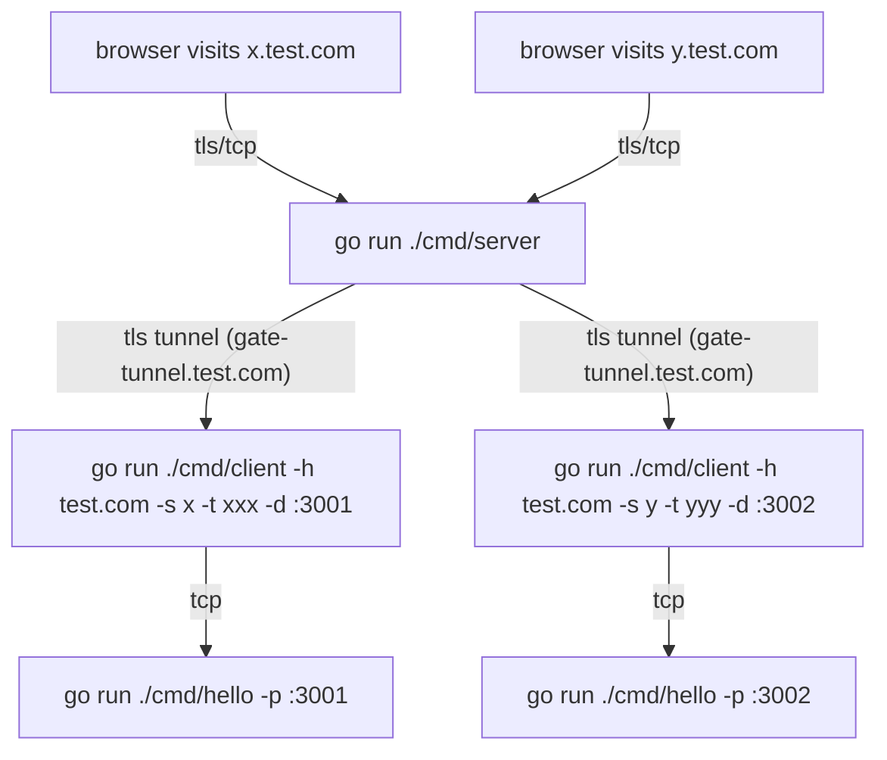

# Overview

A high performance and lightweight gateway to automatically reverse proxy TLS/TCP requests.
It uses the [SNI](https://en.wikipedia.org/wiki/Server_Name_Indication) to route the tcp connection.
It will automatically use the ACME client to obtain, cache, and renew TLS certificates.

Gate will reserve a subdomain `gate-tunnel` on each domain for server-client communication.

## Quick start

Create `gate.json` file like below (doc for config: [conf.go](lib/conf/conf.go)):

```json
{
    "domains": [
        {
            "domain": "test.com",
            "provider": "cloudflare",
            "token": "abc",
            "routes": [
                {
                    "token": "xxx"
                },
                {
                    "token": "yyy"
                }
            ]
        }
    ]
}
```

Run `go run ./cmd/server` to start the gate service.

Run `go run ./cmd/client -h test.com -s x -t xxx -d :3001`
to proxy TLS connections from `x.test.com` to `:3001`.

Run `go run ./cmd/client -h test.com -s y -t yyy -d :3002`
to proxy TLS connections from `y.test.com` to `:3002`.

Run two test http servers `go run ./cmd/hello -p :3001` and `go run ./cmd/hello -p :3002`

The clients don't have to be the same network as the server, they will use
TLS to securely communicate with each other.

The diagram below shows how the above setup works:



## Client lib

If you use golang as the backend you don't have to use the sidecar client binary, you can use the client lib directly:

```go
package main

import (
    "log"
    "net/http"

    "github.com/ysmood/gate/lib/client"
)

func main() {
    l, err := client.New("test.com", "x", "xxx")
    if err != nil {
        log.Fatal(err)
    }

    http.Serve(l, http.HandlerFunc(func(w http.ResponseWriter, r *http.Request) {
        w.Write([]byte("hello!"))
    }))
}
```
